# j2db (JSON to Database)

  

standard and safe way to upload your json to db

## flow

- http request with json data (from wherever you like)
- verify (format and content)
- customize your own flow (full support of hook!)
- upload to db

based on it, developers can easily build their own lightweight cross-platform center for data collection.

## why

Data uploader is a really important part in development workflow.

But many (so many) different db clients in different places or different languages ​​make me feel tired, and i have to implement them in different projects again and again ...

Why do not we use JSON directly? and actually, some (most of) projects should not operate database directly.

## what's the difference with others

> **In production environment, you should consider ELK firstly.** 
> ELK is nearly the best way to handle logging issues. It's standard and stable.

j2db offers a flexible and lightweight (ELK is good but huge) way to developers, which makes them upload the specific contents you care (e.g. CI status) to database, in different platforms or languages, more conveniently.

the point is:

- easy to use in different projects
- lightweight enough, less dependencies
- stable
- customizable

## support more actions? (query / delete / update)

Have no plan now. And, that is why this repo called `j2db`, not `db2j`.

- `query` should be better implemented by others, exposed via HTTP API or something else
- `update` and `delete` will modify the origin data. **BUT, LOG (OR SOMETHING LIKE THAT) SHOULD BE IMMUTABLE.**

## how

- server for receiving http request, and get JSON
- check (support custom hook)
- convert JSON to model (ORM built with SQLAlchemy)
- upload to db

## usage

see [example](example)

## dependencies

- [fastapi](https://github.com/tiangolo/fastapi): as web server
- [sqlalchemy](https://github.com/sqlalchemy/sqlalchemy): as db manager 

## dev plan

see [project kanban](https://github.com/williamfzc/j2db/projects/1)

## bug report & suggestion & contribution

via [issue board](https://github.com/williamfzc/j2db/issues)

welcome to join this project :)

## license

[MIT](LICENSE)
